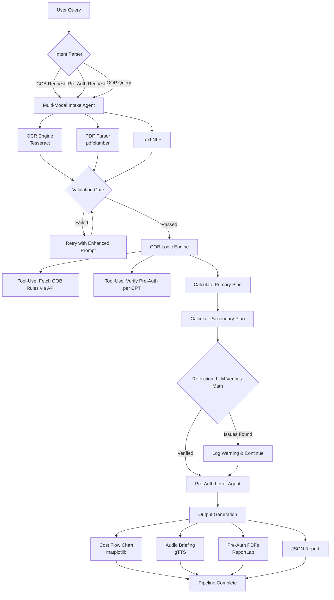
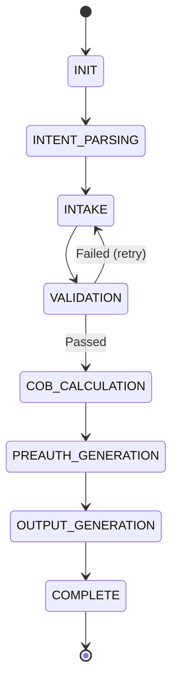

# DuCO-Agent — System Architecture

## High-Level Agent Flow



## State Machine



## Agentic Design Patterns Used

### 1. Tool-Use (External API Calls)
The COB engine doesn't just calculate — it **actively queries** external systems:
- Calls `/api/cob-rules` to verify primary/secondary assignment
- Calls `/api/verify-preauth` for **each** CPT code to check authorization requirements
- Falls back to local knowledge if APIs are unavailable

### 2. Reflection (Self-Verification)
After computing COB amounts, the agent sends its own calculation output to the LLM
and asks it to verify the math. This catches:
- Arithmetic errors
- Rule violations (e.g., overpayment exceeding bill)
- Missing deductible applications

### 3. Retry Loop (Self-Correction)
If the LLM extraction from OCR text fails validation:
1. Identifies what's missing (e.g., "no CPT codes found")
2. Re-prompts with enhanced instructions specifically mentioning the failure
3. Retries up to 2 times before accepting partial data

### 4. Validation Gates
The pipeline does NOT proceed linearly. Validation gates block progress:
- Missing intake data → pipeline halts with clear error
- Empty CPT codes → warning logged, may trigger retry
- COB math assertion → hard fail if insurers + patient > total bill

### 5. Intent-Driven Execution
The orchestrator parses user intent FIRST, then decides which pipeline stages to run:
- If user doesn't ask for pre-auth → skip letter generation
- If user asks about specific patient → prioritize that claim

## Data Flow

```
┌────────────────┐     ┌────────────────┐     ┌────────────────┐
│  INPUT LAYER   │     │ PROCESSING LAYER│     │  OUTPUT LAYER  │
├────────────────┤     ├────────────────┤     ├────────────────┤
│                │     │                │     │                │
│ priya_pt.png   │────>│ OCR + LLM      │     │ cost_flow.png  │
│ (scanned bill) │     │ code extraction │     │ (bar chart)    │
│                │     │                │     │                │
│ aarav_mri.pdf  │────>│ PDF parse + LLM│────>│ preauth PDFs   │
│ (radiology)    │     │ ICD-10 mapping  │     │ (clinical ltrs)│
│                │     │                │     │                │
│ surgeon_est.jpg│────>│ OCR + LLM      │     │ audio.mp3      │
│ (billing sheet)│     │ CPT extraction  │     │ (TTS briefing) │
│                │     │                │     │                │
│ user_query.txt │────>│ Intent NLP     │     │ report.json    │
│ (voice-to-text)│     │                │     │ (full breakdown)│
│                │     │                │     │                │
└────────────────┘     └────────────────┘     └────────────────┘
                              │
                              ▼
                 ┌────────────────────────┐
                 │    MOCK INSURANCE API   │
                 ├────────────────────────┤
                 │ GET /api/cob-rules      │
                 │ GET /api/insurer1/plan   │
                 │ GET /api/insurer2/plan   │
                 │ POST /api/verify-preauth │
                 └────────────────────────┘
```

## COB Calculation Logic (Detailed)

```
For each patient claim:

1. DETERMINE PRIMARY (Birthday Rule)
   └─> Own employer plan = Primary
   └─> Spouse's plan = Secondary

2. PRIMARY PLAN CALCULATION
   └─> Apply annual deductible
   └─> Calculate coinsurance (80/20 split)
   └─> Cap at annual OOP maximum
   └─> Result: patient_oop_after_primary

3. SECONDARY PLAN CALCULATION
   └─> Input: patient_oop_after_primary
   └─> Apply secondary deductible
   └─> Calculate secondary coinsurance
   └─> Result: patient_final_oop

4. ASSERTION
   └─> primary_pays + secondary_pays + patient_oop == total_bill
```

## Technology Choices

| Component | Technology | Rationale |
|-----------|-----------|-----------|
| LLM | Mistral AI | Free tier, good structured output |
| OCR | Tesseract | Industry standard, open source |
| PDF | pdfplumber | Better text extraction than PyPDF2 |
| API | FastAPI | Modern, fast, auto-docs at /docs |
| Charts | matplotlib | Standard, evaluator-friendly |
| TTS | gTTS | Free, Indian English support |
| Tests | pytest | Standard Python testing |
| PDF Gen | ReportLab | Professional PDF output |
